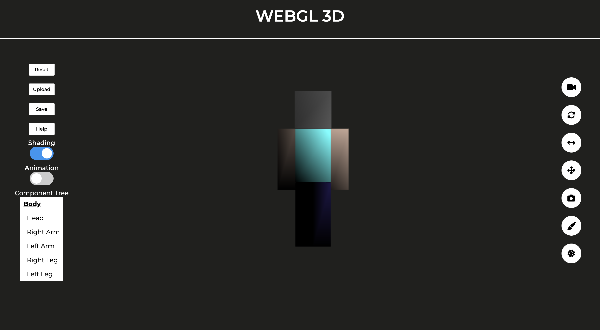

# Tugas 3 IF3260 Grafika Komputer

    
    <h2 align="center">3D Web-GL Hollow Object</h2>

### **Deskripsi Aplikasi**
3D Web-GL _Articulated Model_ ini dapat digunakan untuk melakukan transformasi terhadap _articulated model_. Web ini dibuat dalam rangka memenuhi Tugas 3 IF3260 Grafika Komputer.

### **Pembuat Aplikasi**
| Nama | NIM | 
| --- | --- | 
| Mahesa Lizardy | 13520116 |
| Steven | 13520131 |
| Rania Dwi Fadhilah | 13520142 |
| Mohamad Hilmi Rinaldi| 13520149 |

### **Cara Instalasi**

1. Clone repository ini
2. Buka file index.html yang terdapat pada folder src menggunakan web browser Anda. Pastikan gunakan Web Browser yang support WebGL.
3. Pastikan canvas berhasil ditampilkan pada halaman web dan tidak terdapat pesan error.

### **Cara Penggunaan**
1. Menyimpan & Mengupload Model

> Untuk menyimpan model yang telah dibuat, tekan tombol <b><i>save</i></b> pada bagian kiri layar dan objek akan tersimpan dengan format <b>json</b>.
> Untuk mengupload model yang telah disimpan, tekan tombol <b><i>upload</i></b> pada bagian kiri layar, lalu pilih file berformat <b>json</b>.

2. Memilih Jenis Proyeksi

> Untuk mengubah jenis proyeksi yang diinginkan, tekan tombol <b>proyeksi</b> bergambar video kamera pada bagian kanan layar dan memilih jenis proyeksi yang diinginkan diantara <b>Orthographic</b>, <b>Oblique</b>, atau <b>Perspective</b>.

3. Melakukan Rotasi

> Untuk melakukan rotasi pada objek, tekan tombol <b>rotasi</b> bergambar panah berputar pada bagian kanan layar dan menggeser slider pada sumbu rotasi yang ingin diputar. Apabila ingin melakukan rotasi pada komponen tertentu, pastikan bahwa komponen sudah terpilih pada *component tree*.

4. Melakukan *Scaling*

> Untuk melakukan <i>scaling</i> pada objek, tekan tombol <b><i>scaling</i></b> bergambar panah dua arah pada bagian kanan layar dan menggeser slider pada sumbu yang ingin diperbesar/diperkecil.

5. Melakukan Translasi

> Untuk melakukan translasi pada objek, tekan tombol <b>translasi</b> bergambar panah 4 arah pada bagian kanan layar dan menggeser slider pada sumbu yang ingin ditranslasi.

6. Mengubah *Camera View*

> Untuk mengubah <i>camera view</i> pada objek, tekan tombol <b><i>camera view</i></b> bergambar kamera pada bagian kanan layar.
> Geser slider dengan judul <b><i>Angle</i></b> untuk merubah <b><i>angle camera</i></b>.
> Geser slider dengan judul <b><i>Radius</i></b> untuk merubah <b><i>radius camera</i></b>.

7. Mereset *Camera View*

> Untuk mereset <i>camera view</i> pada objek, tekan tombol <b><i>reset camera view</i></b> pada bagian kiri layar.

8. Menggunakan *Shading / Animation*

> Untuk mengaktifkan <i>shading</i> pada objek, tekan tombol <b><i>shading</i></b> pada bagian kiri layar.
> Untuk mengaktifkan <i>animation</i> pada objek, tekan tombol <b><i>animation</i></b> pada bagian kiri layar.

9. Mengubah Tekstur Permukaan Model

> Untuk mengubah teksur permukaan yang diinginkan, tekan tombol <b>tekstur</b> bergambar kuas pada bagian kanan layar dan pilih jenis permukaan yang diinginkan diantara <b>Bump</b>, <b>Reflective</b>, atau <b>Custom</b>.

10. Lighting

> Untuk mengubah <i>lighting</i> pada objek, tekan tombol <b><i>lighting</i></b> bergambar matahari pada bagian kanan layar dan geser slide sesuai dengan arah yang diinginkan.